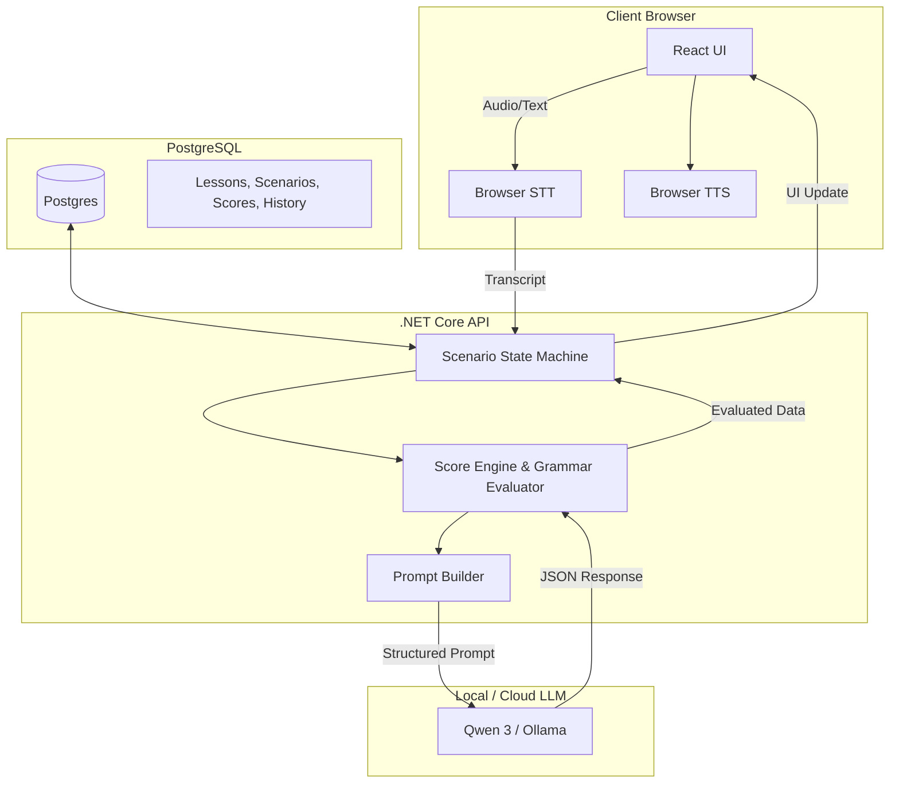

# JAPANESE AI CONVERSATION SYSTEM - BUSINESS LOGIC & ARCHITECTURE

## 2. CHATBOT BUSINESS LOGIC

### The Complete Flow
The application currently runs the conversation loop almost entirely on the client-side (Frontend), utilizing browser APIs and local LLM endpoints.

1. **User speaks**
   - The user clicks the microphone button in the UI (`FloatingChat.tsx` or `ChatMobileLayout.tsx`).
2. **Speech To Text**
   - `speechService.ts` captures the audio using the native `window.SpeechRecognition` (Web Speech API).
   - Audio is transcribed to Vietnamese or Japanese text depending on the selected mic language.
3. **Backend**
   - Currently, there is NO dedicated Backend server for chat orchestration. The "Backend" logic is bundled in the React Frontend (`FloatingChat.tsx`).
4. **Prompt construction**
   - `FloatingChat.tsx` extracts a new question from `minnaDataService.ts`.
   - `buildSenseiSystemPrompt` generates a strict prompt injecting the predefined question and rules.
5. **Qwen (or current LLM)**
   - The prompt is dispatched via `ollamaService.ts` to the local Ollama instance (typically running Qwen3/Qwen2.5) or `geminiService.ts`.
6. **Response**
   - The LLM streams the response back.
   - `parseGuidedKaiwaResponse` in `FloatingChat.tsx` cleans the `<think>` tags and parses the specific `REPLY:`, `JA:`, `RO:`, `VI:` tags to ensure UI safety.
7. **Text To Speech**
   - `speechService.ts` uses the `window.speechSynthesis` API to automatically read the Japanese response aloud (`speakAssistantReply`).
8. **Frontend**
   - The UI (`ChatDesktopLayout.tsx` / `ChatMobileLayout.tsx`) displays the message as an interactive "Question Card" showing the Lesson Number and Grammar Point.

### Responsible Files
- UI & Orchestration: `FloatingChat.tsx`, `ChatDesktopLayout.tsx`, `ChatMobileLayout.tsx`
- STT & TTS: `speechService.ts`
- LLM API: `ollamaService.ts`, `geminiService.ts`
- Data Service: `minnaDataService.ts`

---

## 3. QWEN INTEGRATION

### Which model is used
- The system is built to support **Qwen 2.5 / Qwen 3 (via Ollama)** and **Google Gemini 1.5/2.0 (via REST API)**.

### How prompts are built
- Prompts are generated dynamically in `FloatingChat.tsx` via the `buildSenseiSystemPrompt` function. The system forces the LLM to output exactly 4 tagged lines to bypass its conversational nature.

### How conversation history is stored
- Stored in a React state array `history: ChatHistory[]` inside `FloatingChat.tsx`.
- Maps directly to Ollama's `{ role: 'user' | 'model', text: string }` format.

### How system prompts are created
- The system prompt is prepended or injected as the first instruction before the conversation history is dispatched to the model.

### How user messages are sent
- When `handleSend` triggers, the user's text is appended to the `history` array.
- It is passed into `ollamaService.sendMessage(..., history, systemPrompt)`.

### How responses are parsed
- Responses are passed through `stripChainOfThought(rawText)` to remove `<think>...</think>` outputs common in reasoning models like Qwen.
- `parseGuidedKaiwaResponse` uses regex to extract values matching `REPLY:`, `JA:`, `RO:`, `VI:`.

### Which files call the LLM
- `ollamaService.ts` and `geminiService.ts`.

---

## 4. PROMPTS

### 1. The Continuous Drill Prompt
**Purpose**: Forces the AI to ask questions strictly from the database without grading the user or generating random conversation.
**File**: `FloatingChat.tsx` (`buildSenseiSystemPrompt`)
```text
You are Sensei AI, a continuous Japanese speaking partner for [LEVEL] kaiwa.
The user is doing a continuous question-and-answer drill.
DO NOT grade or assess the user's answer. DO NOT correct their grammar.

Output EXACTLY 4 lines and absolutely NOTHING else. No commentary, no intro, no thoughts. Each line must start with the tag:
REPLY: [Acknowledge the user's answer in Japanese. If they asked a question in Japanese, answer it. If they asked about grammar in Vietnamese, explain it in Vietnamese.]
JA: [The exact Target Question provided below]
RO: [Romaji transcription of the Target Question]
VI: [The exact Target Meaning provided below]

Target Question to ask: "[exampleJa]"
Target Meaning: "[exampleVi]"

Rules:
- NEVER write explanations or meta-commentary in English.
- Your REPLY should be natural and brief unless the user explicitly asked for an explanation.
- After your REPLY, you MUST immediately output the Target Question in JA, RO, and VI tags.
```

### 2. The Grammar Tutor Prompt (Free Chat)
**Purpose**: Used when the user clicks "Hỏi ngữ pháp (Text)" to ask generic grammar questions.
**File**: `FloatingChat.tsx` (`buildSenseiSystemPrompt`)
```text
You are Sensei AI, a Japanese grammar tutor.
Rules:
- Answer in exactly 3 short lines: Japanese, Romaji, Vietnamese explanation.
- Help with grammar patterns, example sentences, and corrections when asked.
- NEVER output thinking, analysis meta-text, or phrases like "let's break this down".
- NEVER analyze a simple greeting unless user asks for grammar help.
- Keep answers under 200 characters total.
- No markdown.
```

---

## 5. CURRENT LIMITATIONS

While recent updates have strictly constrained the AI to act like a tutor following a database, the architecture still suffers from:
1. **No True Backend/Persistent Storage**: The chat state, history, and user scores are stored entirely in React state. If the user refreshes the page, progress is lost.
2. **Context Window Limits**: Because history is appended to the React state and sent to the LLM every turn, long conversations will eventually exceed token limits or slow down response times.
3. **No Automated Scoring/Grammar Verification**: The current continuous mode entirely disables grammar correction (`DO NOT correct their grammar`) because LLMs are notoriously bad at reliably scoring slight variations in spoken Japanese without explicit rule engines.
4. **Data Isolation**: The chat cannot intelligently read the user's Dashboard or Flashcard progress to tailor the questions (e.g., asking questions using vocabulary the user failed in the Flashcard section).

---

## 6. IMPROVEMENT PLAN

To redesign the chatbot into a robust AI Japanese tutor that grades, scores, and follows an absolute lesson plan:

1. **Migrate Orchestration to Backend (.NET API)**: Move the prompt builder, LLM integration, and history management to the C# Backend. The frontend should only handle UI rendering and STT/TTS.
2. **Implement a Scoring Engine**: Instead of relying on the LLM to grade, build a deterministic evaluator in the backend. Send the user's answer to the LLM with a specific "Correction Prompt" that compares it strictly against the database's `expected_answer`, returning JSON `{ "score": 80, "grammar_errors": ["..."], "corrected_ja": "..." }`.
3. **Database Schema Update**: Create tables for `UserSessions`, `ConversationHistory`, and `UserScores` in PostgreSQL/SQL Server.
4. **State Machine for Scenarios**: Implement a state machine in the backend that transitions between states: `Introduction` -> `Ask Question` -> `Wait for Answer` -> `Evaluate` -> `Explain Grammar` -> `Next Question`.

### Proposed Architecture Diagram


