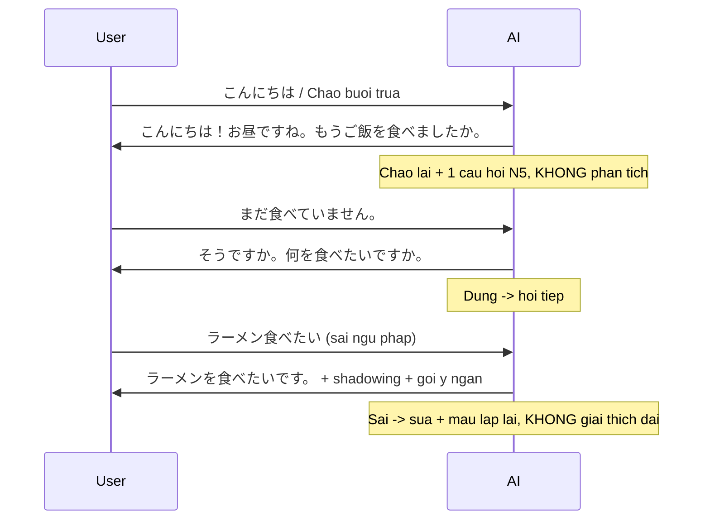
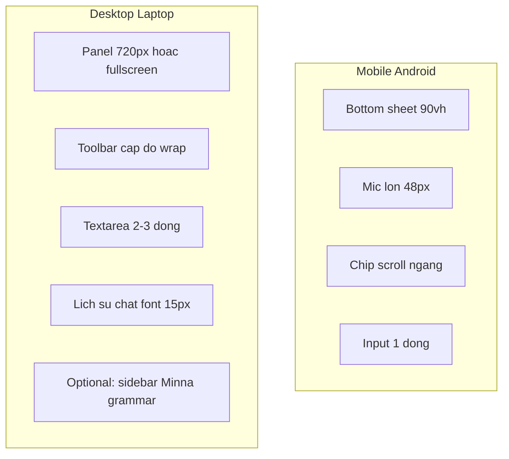
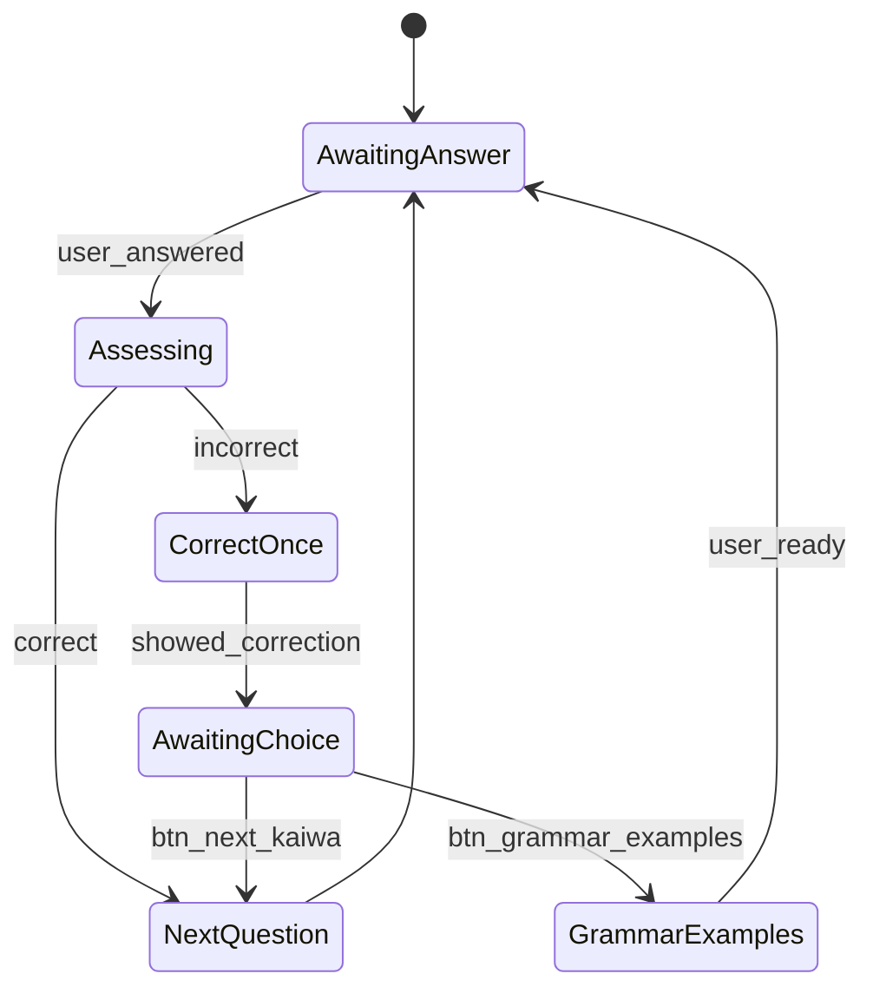

# Plan Toi Uu AI Kaiwa Qwen

## 1. Muc tieu kinh doanh va trai nghiem

Muc tieu cua dot toi uu nay la bien chatbot hien tai thanh mot AI Kaiwa ngan, tu nhien, hoi tung cau, phan hoi nhanh va khong dien giai dai dong.

Trai nghiem mong muon:

- Khi nguoi dung chao, AI chao lai ngan gon va chi hoi tiep 1 cau don gian.
- Khi nguoi dung chon `N5`, AI chi dua 1 cau hoi thuoc muc N5, khong ke them giai thich dai.
- Sau moi cau tra loi cua nguoi dung, he thong phai tu dong danh gia:
  - Dung hoac chap nhan duoc: khen ngan + hoi cau tiep theo.
  - Sai: dua cau sua dung + goi y cach noi bang text va voice.
- Cau tra loi phai ngan, ro form, uu tien toc do va kha nang hoi dap lien tuc.
- Mo hinh uu tien phong cach `Qwen` phan hoi nhanh, it "suy nghi long vong", phu hop lam AI Kaiwa.

## 2. Yeu cau nguoi dung duoc chot

### 2.1 Yeu cau chuc nang

1. Luong hoi thoai phai co trinh tu ro rang.
   - Chao -> hoi 1 cau.
   - Nguoi dung tra loi -> AI cham nhanh.
   - Neu sai -> sua + goi y cau dung.
   - Neu dung -> tiep tuc cau sau.

2. Muc do cau hoi phai theo cap do.
   - Khi nguoi dung chon `N5`, chi hoi noi dung don gian muc N5.
   - Khong nhay len cau phuc tap, khong pha voi nhieu muc tieu khac.

3. Ho tro sua loi noi va viet.
   - Can tra ra text sua chuan.
   - Can co chuoi ngan de doc bang voice cho nguoi dung shadowing.

4. Phan hoi ngan va tu nhien.
   - Khong phan tich dai.
   - Khong liet ke nhieu lua chon trong mot lan tra loi.
   - Khong lam lo "chain of thought" hay "thinking".

### 2.2 Yeu cau phi chuc nang

- Phan hoi nhanh.
- Prompt don gian, it token.
- Han che health check va request du thua.
- Model config uu tien toc do hon van mau me.
- Flow phai on dinh cho chat text va voice.

## 3. Phan tich he thong hien tai

## 3.1 Kien truc dang chay

- Frontend React la noi dieu khien trai nghiem chat chinh tai `frontend/src/components/chat/FloatingChat.tsx`.
- Backend ASP.NET cung cap `POST /api/chat`, `POST /api/chat/stream`, `GET /api/chat/health` tai `backend/src/JapaneseAI.Api/Controllers/ChatController.cs`.
- Backend goi Ollama local qua `backend/src/JapaneseAI.Infrastructure/Services/OllamaService.cs`.
- STT hien tai dung `Web Speech API` o client, khong phai STT backend.
- TTS dang co san o client va co fallback backend proxy cho tieng Viet.
- `ai-service/main.py` hien chua tham gia flow production.

## 3.2 Hanh vi hien tai cua chatbot

- Chatbot tu detect engine: `Qwen3 (Local)` -> `Gemini` -> `Demo`.
- Prompt chat dang build o frontend bang `buildSenseiSystemPrompt()`.
- Prompt hien tai da co huong "tra loi ngan", nhung van theo format 3 dong co dinh:
  - Tieng Nhat
  - Romaji
  - Giai thich tieng Viet
- Chatbot hien chua co state machine cho luong hoc theo buoc.
- Hien chua co "che do N5 hoi tung cau" thuc su, ma van la chat mo rong.
- Nguoi dung hien khong chon model cu the, chi thay engine dang duoc auto-detect.

## 3.3 Cau hinh model hien tai

- Backend dang mac dinh model `qwen3:4b` trong `Program.cs`.
- `OllamaRequest` da dat `Think = false`, giam nguy co lo thinking.
- File `deploy/sensei-qwen3-fast.Modelfile` dang toi uu theo huong fast:
  - `temperature 0.3`
  - `top_k 20`
  - `top_p 0.9`
- He thong chua co cau hinh model theo "persona AI Kaiwa" tach rieng khoi prompt frontend.

## 4. Khoang cach giua yeu cau va he thong hien tai

### 4.1 Van de trai nghiem

1. Chua co luong hoi dap theo buoc.
   Hien tai chatbot van la kieu general chat, nen de tra loi dai, lan man hoac hoi nguoc khong dung muc tieu bai hoc.

2. Prompt dang co xu huong "tra 3 dong cho moi truong hop".
   Dieu nay tot cho hoc tap tong quat, nhung khong toi uu cho kaiwa cuc ngan va phan hoi nhanh.

3. Chua co co che cham cau tra loi.
   He thong chua phan biet ro:
   - cau dung
   - cau gan dung
   - cau sai can sua
   - khi nao hoi cau tiep

4. Chua co output rieng cho "cau noi mau de bat chuoc".
   Hien tai co TTS doc lai cau tra loi, nhung chua co truong du lieu hoac format on dinh cho "mau shadowing".

5. Engine fallback co the lam trai nghiem khong dong nhat.
   Neu rot sang `Gemini` hoac `Demo`, phong cach phan hoi se khac voi luong AI Kaiwa can kiem soat chat.

### 4.2 Van de ky thuat

1. Logic dieu phoi hoi thoai dang o frontend, chua co conversation policy trung tam.
2. Chua co session state hoc tap gom:
   - level dang chon
   - lesson mode
   - cau hien tai
   - ket qua dung/sai gan nhat
3. Chua co schema output co cau truc de UI xu ly on dinh.
4. Health check dang duoc goi trong luong mo chat, can cache de giam do tre.
5. Chua co bai test cho phong cach prompt "ngan, hoi 1 cau, sua sai dung cach".

## 5. Dinh huong giai phap de xuat

Huong toi uu dung nhat khong phai chi "doi model", ma la ket hop 3 lop:

1. Chot model phu hop cho AI Kaiwa.
2. Dung prompt + state machine de ep luong hoi dap ngan.
3. Dung output schema de UI render nhanh, dung va it token.

## 6. Lua chon model

### 6.1 Lua chon uu tien

Uu tien su dung `qwen3:4b-instruct` neu tag nay co san trong moi truong Ollama cua du an.

Neu khong co san, dung 1 trong 2 huong sau:

- Giu `qwen3:4b` nhung doi ten/cau hinh thanh model rieng cho kaiwa, vi du `sensei-qwen3-fast`.
- Tinh chinh `Modelfile` hien co de ep phong cach instruct, ngan, it sang tao va phan hoi nhanh.

### 6.2 Ly do chon Qwen 4B

- Nhe, phan hoi nhanh tren may local.
- Du kha nang cho bai toan kaiwa N5-N4 neu prompt duoc gioi han ro.
- Hop voi muc tieu "it suy nghi long vong" hon cac luong general tutoring dai.

### 6.3 Cau hinh model de xuat

- `temperature`: 0.2 -> 0.4
- `top_p`: 0.8 -> 0.9
- `top_k`: 20 -> 40
- `num_ctx`: vua du cho session ngan, tranh phi token
- `think`: false

Khuyen nghi:

- Bat dau voi `temperature = 0.25` de output on dinh va it lech vai.
- Uu tien model name co the cau hinh bang setting thay vi hardcode.

## 7. Thiet ke luong AI Kaiwa muc tieu

## 7.1 Luong chuan

1. User mo chat.
2. User chon level, vi du `N5`.
3. AI chao lai ngan gon.
4. AI dat 1 cau hoi don gian duy nhat.
5. User tra loi bang text hoac voice.
6. AI danh gia cau vua nhap.
7. AI tra theo 1 trong 2 nhanh:
   - Dung: khen ngan + hoi cau tiep.
   - Sai: dua cau dung + goi y noi lai + neu co voice thi doc mau.

## 7.2 Nguyen tac phan hoi

- Moi lan tra loi toi da 2 y chinh.
- Khong giai thich dai neu nguoi dung khong hoi them.
- Khong dua nhieu cau hoi trong mot message.
- Neu user chi chao: chao lai + 1 cau hoi ngan.
- Neu user dang o mode N5: tu vung, ngu phap, toc do cau hoi deu o muc N5.

## 7.3 Format output de xuat

Thay vi chi tra plain text tu do, can huong den schema on dinh, vi du:

```json
{
  "replyJa": "こんにちは。きょうは何をしましたか。",
  "replyVi": "Xin chao. Hom nay ban da lam gi?",
  "assessment": "correct",
  "correctedJa": "",
  "coachingVi": "Rat tot. Thu tra loi dai hon mot chut.",
  "shadowingJa": "きょうはしごとをしました。",
  "nextQuestionJa": "ばんごはんは何を食べますか。"
}
```

Co the giai doan dau van render plain text, nhung ve kien truc nen chuan bi de nang cap len output co cau truc.

## 8. Ke hoach thuc hien de xuat

### Cập nhật Android Kaiwa (đã thực hiện)

- Đã bổ sung fallback thu âm bằng MediaRecorder cho trình duyệt Android khi Web Speech API không hoạt động hoặc bị chặn.
- Khi người dùng bấm nút mic, hệ thống sẽ ưu tiên nhận diện giọng nói nếu có hỗ trợ, nếu không sẽ chuyển sang thu âm và gửi audio để transcribe.
- Đã điều chỉnh layout overlay Kaiwa để dùng chiều cao viewport thực tế (`--app-viewport-height`) nên khi phóng to/fullscreen, thanh mic và ô nhập văn bản vẫn luôn hiện ở cuối màn hình.
- Đã tăng padding dưới cùng cho input row để tránh bị che bởi safe area của điện thoại.


### Phase 1. Chot chien luoc hoi thoai ngan

Muc tieu:

- Xac dinh ro persona "AI Kaiwa".
- Loai bo cach tra loi dai va tong quat.
- Chot mau phan hoi ngan.

Cong viec:

- Tao prompt moi cho `Kaiwa mode`.
- Tach prompt "chat tong quat" va "kaiwa guided".
- Them rule cuc manh:
  - chi 1 cau hoi moi lan
  - sua sai ngan gon
  - dung thi hoi tiep
  - sai thi cho cau mau

File du kien tac dong:

- `frontend/src/components/chat/FloatingChat.tsx`
- `backend/src/JapaneseAI.Infrastructure/Services/OllamaService.cs`
- co the them file prompt rieng trong `backend` hoac `frontend/src/constants`

### Phase 2. Dua state machine vao luong hoi thoai

Muc tieu:

- Khong de model tu "tu do dieu huong" toan bo hoi thoai.
- He thong nam vai tro dieu phoi.

Cong viec:

- Them session state cho chat:
  - `selectedLevel`
  - `learningMode`
  - `currentQuestion`
  - `lastAssessment`
- Neu user chon `N5`, backend/frontend phai biet chat dang o `guided_kaiwa_n5`.
- Moi request gui them metadata mode de prompt on dinh hon.

De xuat thuc hien:

- Giai doan dau co the quan ly state o frontend de ship nhanh.
- Giai doan sau dua state vao backend neu can dong bo da client.

### Phase 3. Chuan hoa output sua bai

Muc tieu:

- Khi user sai, AI phan hoi dung mau.
- UI co the render text, goi y va TTS mot cach doc lap.

Cong viec:

- Dinh nghia 3 trang thai co ban:
  - `correct`
  - `almost_correct`
  - `incorrect`
- Dinh nghia format output ngam hoac JSON mode.
- Tach cac phan:
  - cau hoi hien tai
  - danh gia cau tra loi
  - cau sua dung
  - cau shadowing
  - cau tiep theo

### Phase 4. Toi uu toc do va do ngan

Muc tieu:

- Giam token va giam do tre.

Cong viec:

- Cache `checkHealth()` trong mot khoang thoi gian ngan.
- Rut gon system prompt.
- Gioi han so turn history gui vao model.
- Giu `stream` neu can cam giac nhanh, nhung UI khong nen render dai dong.
- Loai bo hoan toan cac noi dung debug/thinking.

### Phase 5. Toi uu voice cho Kaiwa

Muc tieu:

- Khi sai, nguoi dung thay ngay cau mau va bam nghe lai duoc.

Cong viec:

- Dung `shadowingJa` hoac dong dau tien lam nguon TTS chinh.
- Neu STT sai nhieu, them thong diep xac nhan transcript truoc khi gui.
- Ve lau dai, can xem xet STT backend bang Whisper/faster-whisper de giam phu thuoc Web Speech API.

## 9. Pham vi file du kien sua

### Frontend

- `frontend/src/components/chat/FloatingChat.tsx`
  - Them che do hoc co huong dan theo level.
  - Them UI chon `N5` ro rang neu chua co.
  - Rut gon welcome message va suggestion chip.
  - Dieu phoi logic "dung thi hoi tiep, sai thi sua".

- `frontend/src/services/ollamaService.ts`
  - Ho tro truyen metadata mode/level.
  - Cache health check.
  - Ho tro output co cau truc neu backend nang cap.

- `frontend/src/services/speechService.ts`
  - Uu tien doc cau shadowing.
  - Cai thien tra loi cho luong "nghe va lap lai".

### Backend

- `backend/src/JapaneseAI.Api/Controllers/ChatController.cs`
  - Mo rong request schema de nhan `mode`, `level`, `currentQuestion`, `assessmentMode`.

- `backend/src/JapaneseAI.Infrastructure/Services/OllamaService.cs`
  - Chot prompt trung tam cho AI Kaiwa.
  - Ho tro model config linh hoat.
  - Neu can, parse output schema.

- `backend/src/JapaneseAI.Api/Program.cs`
  - Dua model name vao config de de doi giua `qwen3:4b`, `qwen3:4b-instruct`, `sensei-qwen3-fast`.

### Deploy

- `deploy/sensei-qwen3-fast.Modelfile`
  - Tinh chinh them theo muc tieu Kaiwa nhanh.

## 10. Thu tu uu tien de trien khai

1. Chot luong UX va prompt moi cho `Kaiwa N5`.
2. Tach state "guided kaiwa" khoi chat tong quat.
3. Cho phep config model name, uu tien `qwen3:4b-instruct` neu co.
4. Rut gon welcome message va response style.
5. Them logic danh gia dung/sai va dua cau shadowing.
6. Toi uu health check, history, token usage.
7. Test text flow.
8. Test voice flow.
9. Chi sau do moi can nhac nang cap STT backend.

## 11. Tieu chi chap nhan

- Khi user chi chao, AI chao lai va chi hoi 1 cau.
- Khi user chon `N5`, AI hoi cau dung muc N5, ngan va de.
- Khi user tra loi dung, AI khong giai thich dai, chi khen ngan va hoi cau tiep.
- Khi user tra loi sai, AI dua:
  - cau dung
  - goi y ngan bang tieng Viet
  - cau mau de nghe/shadowing
- Thoi gian phan hoi cam nhan nhanh hon hien tai.
- UI khong hien thinking/debug.
- Hanh vi giua text va voice la nhat quan.

## 12. Rui ro va luu y

1. Chi doi model khong du.
   Neu khong co state machine va prompt ro, model van co the tra loi dai.

2. `qwen3:4b-instruct` co the khong ton tai dung tag trong moi truong Ollama hien tai.
   Can kiem tra tag thuc te truoc khi hardcode.
 
 ## Fix: Hiển thị "N2-BS", "Từ láy", "Lượng từ" (Tags)

 Vấn đề hiện tại
 - Một số mục có `tags` chứa nhiều giá trị, ví dụ `"special,onomatopoeia"`.
 - Frontend và backend trước đây kiểm tra `tags === "special"` (so sánh chính xác), nên khi `tags` chứa thêm giá trị khác, bộ lọc không bắt được.

 Mục tiêu
 - Đảm bảo mọi chỗ lọc `special` kiểm tra theo danh sách (CSV) thay vì so sánh chính xác.
 - Cập nhật code, rebuild frontend và (tuỳ chọn) reseed DB nếu cần.

 Công việc cụ thể (thực hiện)
 1. Code: thay tất cả chỗ so sánh `Tags == "special"` hoặc `v.tags === 'special'` bằng kiểm tra includes trên danh sách: `tags?.split(',').map(t=>t.trim().toLowerCase()).includes('special')`.
    - Đã cập nhật: `frontend/src/services/apiService.ts` và `backend/src/JapaneseAI.Api/Controllers/VocabularyController.cs`.
 2. Regenerate dataset nếu cần:
    - `node scripts/import-vocabulary-data.js`
    - `node scripts/auto-tag-vocab.js`
    - `node scripts/generate-flashcards.js`
 3. Build frontend để kiểm tra:
    ```powershell
    cd frontend
    npm run build:check
    ```
 4. (Optional) Start backend to seed DB from JSON (will import `all_vocabulary.json`):
    ```powershell
    cd backend\src\JapaneseAI.Api
    dotnet run
    ```

 Kiểm tra/Validation
 - Frontend: Mở `Flashcard` hoặc `Vocabulary` page, chọn bộ đặc biệt `N2-BS`, `Từ láy`, `Lượng từ` — các số lượng và danh sách từ phải xuất hiện.
 - Backend: `GET /api/vocabulary?category=n2_bs` và `GET /api/vocabulary?category=tu_lay` trả danh sách mong muốn; `GET /api/vocabulary/stats` có trường `special` với `n2_bs`, `tu_lay`, `luong_tu` đúng.

 Nếu vẫn không thấy:
 - Kiểm tra `data/vocabulary/all_vocabulary.json` xem trường `tags` có chứa `special` (hoặc `special` không trùng case/whitespace).
 - Chạy `node scripts/auto-tag-vocab.js` để bổ sung tag `special` cho những sheet được ghi `special` trong Excel (nếu cần viết thêm logic). 

 Thời gian ước tính: 30–60 phút (code changes + build + optional DB seed).

3. Voice input van phu thuoc Web Speech API.
   Neu moi truong browser khong on dinh, trai nghiem Kaiwa van bi anh huong.

4. Neu giu fallback `Gemini`/`Demo`, can co prompt parity de tranh lech phong cach.

## 13. Cach verify

### Kiem tra text flow

- Case 1: user nhap `Xin chao`
  - Mong doi: AI chao lai + 1 cau hoi ngan.

- Case 2: user chon `N5`
  - Mong doi: AI hoi 1 cau N5, khong phan tich dai.

- Case 3: user tra loi sai ngu phap
  - Mong doi: AI sua ngan + cho cau dung + moi noi lai.

- Case 4: user tra loi dung
  - Mong doi: AI khen ngan + hoi tiep 1 cau.

### Kiem tra voice flow

- Noi 1 cau dung.
- Noi 1 cau sai.
- Tu choi quyen mic.
- STT nhan sai transcript.
- Bam nghe lai cau shadowing.

### Kiem tra hieu nang

- So sanh do tre trung binh truoc/sau.
- So sanh do dai token/response.
- Kiem tra so lan goi health check khi mo chat va khi gui nhieu tin nhan lien tiep.

## 14. Khuyen nghi trien khai

Khuyen nghi tot nhat cho dot tiep theo:

1. Khong sua dan trai khap noi cung luc.
2. Lam 1 `Kaiwa Guided Mode` rieng cho `N5` truoc.
3. Dung `Qwen` local la engine chinh.
4. Cho phep config de uu tien `qwen3:4b-instruct` neu moi truong co ho tro.
5. Neu khong, tiep tuc dung `sensei-qwen3-fast` tren nen `qwen3:4b`.

## 15. Buoc tiep theo sau khi duyet plan

Sau khi duyet plan nay, buoc thuc thi nen la:

1. Chot UX flow cho `Kaiwa Guided N5`.
2. Sua prompt va them state machine toi thieu.
3. Sua config model de co the doi qua `qwen3:4b-instruct` hoac `sensei-qwen3-fast`.
4. Build frontend/backend.
5. Test lai text + voice tren local.

---

## 16. Cap nhat yeu cau moi (2026-07-05)

Dot cap nhat nay tap trung vao trai nghiem Kaiwa tu nhien hon, UI de dung tren ca dien thoai Android va may tinh, va loai bo hanh vi "giao vien phan tich cau" khi nguoi dung chi dang chao hoi.

### 16.1 Tom tat yeu cau nguoi dung

| # | Yeu cau | Muc tieu |
|---|---------|----------|
| A | Kaiwa chao hoi tu nhien | User chao -> AI chao lai dung ngữ cảnh -> hoi 1 cau N-level, khong phan tich cau user |
| B | Nut chon cap do JLPT | N5, N4, N3, N2, N1, N2-BS trong chatbot |
| B2 | Luong hoi dap lien tuc | Hoi - tra loi - hoi tiep; chi sua khi sai ngu phap/tu vung trong cau tra loi bai hoc |
| C | Nut phong to fullscreen | Mo rong chatbot toan man hinh de luyen Kaiwa de hon |
| D | Gop che do Voice + Text | Kaiwa: vua noi vua go duoc, AI vua doc vua hien text |
| E | Che do Text-only rieng | Chi dung text-text khi hoi ngu phap, mau cau, giai thich |
| F | Layout rieng Mobile vs Desktop | Android va PC co UI phu hop, khong chi mot layout kieu dien thoai |

### 16.2 Vi du luong mong muon (Kaiwa N5)



### 16.3 Van de hien tai can fix

#### A. AI phan tich cau khi user chi chao hoi

**Triệu chứng:** User noi `こんにちは 先生 今もうご飯を食べますか` thi AI tra loi kieu:
`Okay, let's break this down... First, I need to check the conversation flow...`

**Nguyen nhan co the:**
1. Dang o che do `free-chat` hoac prompt tutoring thay vi `guided_kaiwa`.
2. Model Qwen/Gemini tu "suy nghi long vong" (chain-of-thought) lo ra UI.
3. State machine chua phan biet `turnIntent`:
   - `greeting` -> chi chao lai + hoi tiep, **khong cham diem**
   - `lesson_answer` -> moi danh gia dung/sai
4. Prompt free-chat van huong "giai thich, sua loi" cho moi cau.

**Huong fix:**
- Them `turnIntent` vao session: `greeting | lesson_answer | grammar_question`.
- Khi `turnIntent = greeting`: force prompt "reply naturally, one greeting + one question, STATUS optional or skip assessment".
- Chan tuyet doi output CoT/thinking o backend + frontend filter.
- Guided kaiwa mac dinh khi user bam nut N5/N4/... thay vi free-chat.

#### B. Chi co nut N5, chua co N4-N1, N2-BS

**Hien tai:** `PRACTICE_MODES` chi co chip `Kaiwa N5` + `Tu do`.

**Can co:** Hang nut cap do:
`N5 | N4 | N3 | N2 | N1 | N2-BS`

Moi cap do:
- Prompt gioi han tu vung/ngu phap dung muc.
- Bo cau hoi starter theo chu de (chao hoi, an uong, cong viec...).
- Metadata `level` gui len API.

#### C. 4 che do chat gay nham lan

**Hien tai:** Voice->Voice, Voice->Text, Text->Voice, Text->Text.

**Van de:**
- `voice-to-voice` **tat o input text** (`disabled={voiceInput}`) -> user khong go duoc.
- User muon Kaiwa = **voice + text dong thoi** ca vao va ra.

**De xuat don gian hoa thanh 2 che do:**

| Che do | Input | Output | Dung khi |
|--------|-------|--------|----------|
| **Kaiwa** | Mic + o nhap text (ca hai) | Text hien thi + TTS tu doc | Luyen noi, hoi dap theo cap JLPT |
| **Ngu phap / Hoi bai** | Chi text | Chi text | Hoi mau cau, ngu phap, giai thich |

Gan che do voi `learningMode`:
- `guided_kaiwa` -> mac dinh che do Kaiwa (hybrid).
- `free_chat` / `grammar_tutor` -> che do text-only.

#### D. Chua co fullscreen

**Hien tai:** `.chat-overlay` co dinh `max-width: 400px`, `height: 580px`.

**Can them:**
- Nut phong to / thu nho o header (icon Maximize / Minimize).
- Class `.chat-overlay--fullscreen`: `width: 100vw; height: 100vh; max-width: none; border-radius: 0`.
- Luu trang thai fullscreen trong session (localStorage neu can).

#### E. Layout chi giong dien thoai

**Hien tai CSS:**
- Mobile: full width, bottom sheet.
- Desktop: van popup nho 400x580px, UX uu tien mic.

**Van de nguoi dung:** Tren may tinh van cam giac "che do dien thoai", kho nhin lich su chat va go text.

**De xuat layout 2 tang:**

| Thiet bi | Layout | UX uu tien |
|----------|--------|------------|
| **Android / mobile** (<768px) | Bottom sheet hoac fullscreen, mic lon, chip level scroll ngang | Noi + nghe |
| **Desktop** (>=768px) | Panel rong hon (480-640px) hoac fullscreen, input text ro, lich su chat cao hon | Vua go vua noi |

Them `useDeviceLayout()`:
- Detect `window.matchMedia('(max-width: 767px)')` + optional `navigator.userAgent` cho Android.
- Auto chon layout; cho phep user override neu can.

---

## 17. Trang thai trien khai sau Phase 2

| Phase | Noi dung | Trang thai |
|-------|----------|------------|
| 1 | Prompt ngan, tach Kaiwa / free chat | **Da xong phan lon** |
| 2 | State machine session | **Da xong phan lon** (frontend) |
| 3 | Output sua bai chuan | **Mot phan** (tag parser, chua JSON) |
| 4 | Toc do / token | **Mot phan** (health cache, think=false) |
| 5 | Voice shadowing | **Mot phan** (TTS co, STT confirm chua) |
| **6** | **Kaiwa chao hoi tu nhien + chan CoT** | **Chua lam** |
| **7** | **Nut JLPT N5-N1, N2-BS** | **Chua lam** (chi N5) |
| **8** | **Fullscreen chatbot** | **Chua lam** |
| **9** | **2 che do: Kaiwa hybrid vs Grammar text** | **Chua lam** |
| **10** | **Layout Mobile vs Desktop** | **Chua lam** |

---

## 18. Ke hoach thuc hien dot moi

### Phase 6. Kaiwa chao hoi tu nhien va chan phan tich sai luc

**Muc tieu:** User chao thi AI chao lai + hoi tiep; chi sua khi tra loi bai hoc sai.

**Cong viec:**

1. Them `turnIntent` vao `KaiwaSession`:
   - `greeting`: user chi chao / mo dau hoi thoai
   - `lesson_answer`: user tra loi cau hoi dang cho
   - `grammar_question`: user hoi ngu phap (che do text-only)

2. Sua prompt guided kaiwa:
   - Neu `turnIntent = greeting`: tra loi tu nhien theo thoi gian (sang/trua/toi), hoi 1 cau N-level, **khong** danh gia STATUS.
   - Neu `turnIntent = lesson_answer`: moi dung STATUS correct/almost_correct/incorrect.
   - Rule cung: **NEVER** output "let's break down", "first I need to check", thinking, phan tich meta.

3. Backend filter:
   - Strip pattern CoT truoc khi tra ve client.
   - Dam bao `think: false` va model `sensei-qwen3-fast`.

4. Frontend filter:
   - Neu response chua "Okay, let's" / "First, I need" -> reject va retry hoac fallback ngan.

**File:**
- `frontend/src/types/index.ts`
- `frontend/src/utils/kaiwaSession.ts`
- `frontend/src/components/chat/FloatingChat.tsx`
- `backend/src/JapaneseAI.Infrastructure/Services/OllamaService.cs`

**Tieu chi chap nhan:**
- User: `Chao buoi trua` -> AI: `こんにちは！お昼ですね。もうご飯を食べましたか。` (khong phan tich).
- User chao khong bao gio thay badge "Can sua" hay giai thich ngu phap dai.

---

### Phase 7. Nut cap do JLPT trong chatbot

**Muc tieu:** Chon N5/N4/N3/N2/N1/N2-BS de luyen Kaiwa dung muc.

**Cong viec:**

1. UI: hang chip cap do thay cho 1 nut "Kaiwa N5":
   ```
   [N5] [N4] [N3] [N2] [N1] [N2-BS]
   ```

2. Data starter theo level:
   - `GUIDED_STARTERS` mo rong cho tung level.
   - N2-BS: bo cau hoi bo sung / luyen tap them cho N2.

3. Prompt theo level:
   - N5: tu vung co ban, です/ます, cau ngan.
   - N4-N2: tang do dai cau, thi, hon nhiem.
   - N1: hoi thoai tu nhien hon, van giu 1 cau/lan.

4. Metadata API: `level: N5 | N4 | ... | N2-BS`.

**File:**
- `frontend/src/utils/kaiwaSession.ts` (starters)
- `frontend/src/constants/kaiwaLevels.ts` (moi)
- `frontend/src/components/chat/FloatingChat.tsx`
- `backend/.../OllamaService.cs` (level rules)

**Tieu chi chap nhan:**
- Bam N4 -> AI hoi cau muc N4, khong dung cau qua de cua N5.
- Doi level giua cho -> reset session, cau hoi moi dung muc.

---

### Phase 8. Fullscreen chatbot

**Muc tieu:** Nut phong to de luyen Kaiwa tren man hinh lon.

**Cong viec:**

1. Nut toggle o header chat (Maximize2 / Minimize2).
2. CSS class `.chat-overlay--fullscreen`.
3. Khi fullscreen: an scroll trang nen, focus vao input/mic.
4. Ho tro ca mobile (fullscreen that su) va desktop.

**File:**
- `frontend/src/components/chat/FloatingChat.tsx`
- `frontend/src/styles/index.css`

**Tieu chi chap nhan:**
- Bam phong to -> chat phu toan viewport.
- Bam thu nho -> ve popup nhu cu.

---

### Phase 9. Don gian hoa 2 che do tuong tac

**Muc tieu:** Kaiwa = voice+text; Grammar = text-only.

**Cong viec:**

1. Bo 4 chip Voice->Voice / Voice->Text / Text->Voice / Text->Text.
2. Thay bang 2 che do ro rang:
   - **Kaiwa (Noi + Viet)**: mic luon bat + o text luon nhap duoc; AI luon hien text + auto TTS.
   - **Hoi ngu phap (Text)**: chi o text, khong TTS mac dinh.

3. Sua logic:
   - `isVoiceInputMode` khong con disable text input trong che do Kaiwa.
   - `speakAssistantReply` luon goi trong che do Kaiwa.
   - Che do Grammar dung `free_chat` + prompt tutoring ngan.

4. Mac dinh khi mo chat:
   - Neu chon N5/N4/... -> che do Kaiwa.
   - Neu chon "Hoi ngu phap" -> che do Text.

**File:**
- `frontend/src/components/chat/FloatingChat.tsx`
- `frontend/src/types/index.ts` (InteractionMode type)

**Tieu chi chap nhan:**
- Che do Kaiwa: go duoc va noi duoc cung luc.
- AI tra loi: thay text + nghe duoc giong noi.
- Che do Grammar: chi text, phu hop hoi "て形 là gì".

---

### Phase 10. Layout rieng Android vs Desktop

**Muc tieu:** UI phu hop tung thiet bi, khong chi mot kieu mobile.

**Cong viec:**

1. Hook `useDeviceLayout()`:
   - `mobile` | `desktop` | `android` (optional detect).

2. **Mobile / Android:**
   - Bottom sheet cao (70-90vh) hoac fullscreen.
   - Mic button lon, chip level scroll ngang.
   - Input 1 dong, de cham.

3. **Desktop:**
   - Panel 520-640px, chieu cao 680-80vh.
   - Lich su chat rong hon, font de doc.
   - Input co the nhieu dong (textarea nho).
   - Khong ep che do voice-only.

4. CSS responsive tach ro:
   - `.chat-overlay--mobile`
   - `.chat-overlay--desktop`
   - `.chat-overlay--fullscreen` ap dung ca hai.

**File:**
- `frontend/src/hooks/useDeviceLayout.ts` (moi)
- `frontend/src/styles/index.css`
- `frontend/src/components/chat/FloatingChat.tsx`

**Tieu chi chap nhan:**
- Tren Android Chrome: UI to, de bam mic.
- Tren PC: panel rong, de doc lich su + go text.
- Khong cam giac "chi co che do dien thoai" tren desktop.

---

## 19. Thu tu uu tien trien khai (cap nhat)

1. **Phase 6** — Fix chao hoi tu nhien + chan CoT (uu tien cao nhat, fix loi user dang gap).
2. **Phase 9** — Gop che do Kaiwa voice+text (fix input bi khoa).
3. **Phase 7** — Them nut N5-N1, N2-BS.
4. **Phase 8** — Fullscreen.
5. **Phase 10** — Layout mobile vs desktop.
6. Tiep tuc Phase 3-5 cu (JSON output, toc do, STT confirm).

---

## 20. Tieu chi chap nhan tong (cap nhat)

### Kaiwa flow
- [ ] User chao buoi trua -> AI chao buoi trua + hoi an com chua (N5).
- [ ] User tra loi dung -> AI hoi cau tiep theo, khong giai thich dai.
- [ ] User tra loi sai ngu phap/tu vung -> AI sua ngan + shadowing + doc mau.
- [ ] User chi chao -> **khong** phan tich cau, **khong** hien thinking/CoT.

### Cap do JLPT
- [ ] Co nut N5, N4, N3, N2, N1, N2-BS.
- [ ] Moi cap do hoi dung muc do kho.

### UI / UX
- [ ] Co nut phong to fullscreen.
- [ ] Che do Kaiwa: voice + text vao/ra.
- [ ] Che do Grammar: chi text.
- [ ] Android va Desktop co layout rieng, de dung.

### Ky thuat
- [ ] Khong lo thinking ra UI.
- [ ] Guided kaiwa luon dung non-stream + tagged/JSON output.
- [ ] Build frontend + backend pass.

---

## 21. Test cases bo sung

| # | Hanh dong | Ket qua mong doi |
|---|-----------|------------------|
| T1 | Chon N5, noi "Chao buoi trua" | AI: chao buoi trua + hoi an com chua |
| T2 | Tra loi "まだ" (dung ngữ cảnh) | AI hoi tiep, khong sua |
| T3 | Tra loi sai ngu phap | AI sua + mau shadowing |
| T4 | Bam N4 | Cau hoi muc N4 |
| T5 | Bam fullscreen | Chat phu man hinh |
| T6 | Desktop: go text trong che do Kaiwa | Gui duoc, AI tra text + voice |
| T7 | Che do Grammar: hoi "て形" | Chi text, khong TTS |
| T8 | Android Chrome: mo chat | UI mobile, mic de bam |
| T9 | PC: mo chat | Panel rong hon mobile |
| T10 | User chi noi "こんにちは" | Khong thay "Okay, let's break this down" |

---

## 22. Rui ro va luu y (cap nhat)

1. **N2-BS** can dinh nghia ro: bo cau hoi bo sung N2 hay luyen tap rieng — can chot noi dung truoc khi code.
2. **Hybrid voice+text** tren mobile: can test quyen mic + ban phim cung luc tren Android Chrome.
3. **Chan CoT** khong the 100% chi dua prompt — can filter backend + fallback retry.
4. **Nhieu cap JLPT** can bo cau hoi/starter — co the dung template + random theo chu de thay vi hardcode tung cau.
5. **Fullscreen** tren iOS Safari co the can `-webkit-fill-available` cho chieu cao.

---

## 23. Buoc tiep theo de xuat

Sau khi duyet plan cap nhat:

1. Implement Phase 6 (chao hoi + chan CoT) — fix nhanh loi dang gap.
2. Implement Phase 9 (Kaiwa hybrid voice+text).
3. Implement Phase 7 (nut JLPT).
4. Implement Phase 8 + 10 (fullscreen + layout).
5. Test tren Android Chrome va desktop Chrome/Edge.
6. Build va verify lai toan bo.

---

## 24. Cap nhat yeu cau (2026-07-05 lan 2)

### 24.1 Tom tat 3 yeu cau moi

| # | Yeu cau | Van de hien tai |
|---|---------|-----------------|
| G | **Desktop/Laptop UI rieng biet** | Tren PC van cam giac UI Android — popup nho, bottom sheet, chip scroll ngang |
| H | **Sua loi chi 1 lan** | Sai phat am/ngu phap -> sua 1 lan -> hien 2 nut: "Them vi du ngu phap" / "Tiep tuc Kaiwa mau khac" |
| I | **Tich hop Excel Minna N5** | Dung `tu_vung_n5_minna_ngu_phap_1_25.xlsx` de hoi cau, phan tich ngu phap, lay mau cau |

---

## 25. Phan tich loi UI Desktop tren Laptop/PC

### 25.1 Trieu chung nguoi dung bao cao

Tren laptop/PC mo website, chatbot van hien nhu **Android UI**:
- Popup nho goc duoi phai
- Cam giac bottom sheet dien thoai
- Kho doc lich su chat, kho go text dai
- Header hien "Mobile" hoac layout khong khac biet ro

### 25.2 Nguyen nhan ky thuat (da xac minh trong code)

#### A. Desktop layout hien tai qua yeu — gan nhu chi rong hon 160px

File [`frontend/src/styles/index.css`](frontend/src/styles/index.css):

```css
.chat-overlay { max-width: 400px; ... border-radius bottom-sheet }
.chat-overlay--desktop { max-width: 560px; height: min(680px, 82vh); }
.chat-overlay--mobile { max-width: 100%; height: min(90vh, 100dvh); }
```

**Van de:** Desktop chi tang tu 400px -> 560px. Van la **floating popup goc phai**, khong phai layout web PC that su. User PC mong doi:
- Panel lon hon (720-960px) hoac fullscreen mac dinh
- Input textarea nhieu dong
- Khong co cam giac "app dien thoai nhung chay tren Chrome"

#### B. Logic detect thiet bi co the sai trong mot so truong hop

File [`frontend/src/hooks/useDeviceLayout.ts`](frontend/src/hooks/useDeviceLayout.ts):

```typescript
return isMobileWidth || isAndroid ? 'mobile' : 'desktop';
```

| Truong hop | Ket qua | Ghi chu |
|------------|---------|---------|
| Laptop Windows, cua so >= 768px | `desktop` | Dung ve mat class |
| Laptop Windows, cua so < 768px (split screen) | `mobile` | Co the gay nham |
| Chrome DevTools mobile mode | `mobile` | Dung |
| **Desktop class nhung CSS gan giong mobile** | User thay "Android UI" | **Day la nguyen nhan chinh** |

**Ket luan:** Label "Desktop" co the dung nhung **UI thuc te van giong mobile** vi chi khac width/height nhe, cung cau truc 1 cot, cung chip scroll ngang, cung input 1 dong.

#### C. Chua co layout component rieng cho PC

Hien tai `FloatingChat.tsx` dung **cung JSX** cho mobile va desktop, chi doi class CSS va mic size (40px vs 48px). Chua co:
- Layout 2 cot (sidebar grammar + chat)
- Textarea thay input
- Toolbar cap do wrap (khong scroll ngang)
- Mac dinh fullscreen tren desktop >= 1024px

### 25.3 Thiet ke Desktop UX muc tieu (Phase 11)



| Thanh phan | Mobile | Desktop (>=1024px) |
|------------|--------|---------------------|
| Kich thuoc mac dinh | 100% width, 90vh | 720px x 85vh hoac fullscreen |
| Vi tri | Bottom sheet | Center-right panel hoac center modal |
| Input | `<input>` 1 dong | `<textarea>` 2-3 dong |
| Cap do JLPT | Scroll ngang | Wrap 2 hang, nut lon hon |
| Mode bar | Day du | Co the collapse "Cai dat" |
| Mic | 48px, uu tien | 40px, ben canh textarea |
| Grammar sidebar | An | Hien panel "Bai dang hoc" tu Excel |

### 25.4 Cong viec fix Desktop (Phase 11)

1. **Sua `useDeviceLayout`:**
   - Chi dung `matchMedia('(min-width: 1024px)')` cho desktop (khong mix Android UA)
   - Tablet 768-1023: layout `tablet` trung gian
   - Cho phep user toggle "Che do PC" / "Che do dien thoai" trong chat settings

2. **Tach component layout:**
   - `ChatMobileLayout.tsx`
   - `ChatDesktopLayout.tsx`
   - Shared: messages, handlers, session state

3. **CSS desktop ro rang:**
   ```css
   .chat-overlay--desktop {
     max-width: 720px;
     width: min(720px, 90vw);
     height: min(85vh, 900px);
     left: auto; right: 32px; bottom: 24px;
   }
   .chat-overlay--desktop-full {
     /* mac dinh tren man >= 1440px */
     max-width: 960px;
     width: 60vw;
   }
   ```

4. **Input desktop:** textarea + Shift+Enter xuong dong, Enter gui

5. **Acceptance:** User mo tren laptop 1920x1080 -> khong con cam giac app Android; panel rong, de doc, de go.

---

## 26. Luong sua loi "1 lan" + nut hanh dong (Phase 12)

### 26.1 Yeu cau nguoi dung

Khi phat am sai / ngu phap sai / tu vung sai:
1. AI **sua dung 1 lan** (shadowing + goi y ngan)
2. **Khong** lap lai sua nhieu lan, khong giai thich dai
3. Sau khi sua xong, hien **2 nut**:

| Nut | Hanh vi |
|-----|---------|
| **Them vi du ngu phap** | Lay mau cau tu Excel Minna theo `Bài ngữ pháp` lien quan, hien 1-2 vi du + giai thich ngan |
| **Tiep tuc Kaiwa mau khac** | Chuyen sang cau hoi Kaiwa moi (cung level), bo qua cau cu |

### 26.2 Van de luong hien tai

State machine hien tai:
```
incorrect -> correcting -> user tra loi lai -> co the incorrect lan nua -> correcting ...
```

Khong co:
- Gioi han `correctionCount` (chi sua 1 lan)
- Trang thai `awaiting_user_choice` sau khi sua
- Nut hanh dong sau correction

### 26.3 State machine moi (de xuat)



**Session fields moi:**

```typescript
interface KaiwaSession {
  // ... existing
  correctionCount: number;        // 0 | 1 — chi cho sua 1 lan / cau
  postCorrectionAction?: 'grammar_examples' | 'next_kaiwa' | null;
  activeGrammarPoint?: string;    // "Bài 6: Nを Vます"
  lastWrongAnswer?: string;
}
```

### 26.4 UI sau khi sua loi

```
┌─────────────────────────────────────┐
│ [Can sua]                           │
│ ラーメンを食べたいです。              │
│ Ramen o tabetai desu.               │
│ Hay lap lai cau mau nay.            │
│ ┌─ Mau lap lai ─────────────────┐  │
│ │ ラーメンを食べたいです。          │  │
│ └────────────────────────────────┘  │
│                                     │
│ [Them vi du ngu phap] [Kaiwa tiep]  │
└─────────────────────────────────────┘
```

- Nut chi hien khi `sessionState === 'awaiting_choice'`
- Bam "Them vi du ngu phap" -> load tu Excel, khong goi AI (nhanh)
- Bam "Kaiwa tiep" -> AI hoi cau moi tu question bank

### 26.5 Prompt rule khi incorrect

- Lan 1 sai: STATUS incorrect + shadowing + VI ngan (1 dong)
- **Khong** hoi lai cung cau ngay — chuyen sang `awaiting_choice`
- Neu user tu tra loi lai ma chua bam nut: nhan manh "Hay chon Tiep tuc hoac Xem vi du"

---

## 27. Phan tich file Excel Minna N5 (`tu_vung_n5_minna_ngu_phap_1_25.xlsx`)

### 27.1 Cau truc du lieu (da parse)

**Sheet:** `Từ Vựng N5 - Ngữ Pháp Minna`  
**So dong:** 730 tu vung  
**So diem ngu phap unique:** 43 (Bai 1-25 Minna, nhieu pattern moi bai)

| Cot | Ten | Vi du | Dung cho |
|-----|-----|-------|----------|
| A | STT | 1 | ID |
| B | 漢字 | 私 | Tu vung |
| C | ひらがな | わたし | Phat am |
| D | Hán Việt | Tư | Han Viet |
| E | Nghĩa | Tôi | Nghia tieng Viet |
| F | Chưa thuộc | (checkbox) | Trang thai hoc (optional) |
| G | Từ loại | N | Loai tu |
| H | Ví dụ (Tiếng Nhật) | わたしは今、会議室にいます。 | **Mau cau Kaiwa / grammar** |
| I | Ý nghĩa ví dụ | Tôi bây giờ đang ở phòng họp. | Dich vi du |
| J | Bài ngữ pháp | Bài 10: Nが います | **Pattern ngu phap** |

### 27.2 Mau diem ngu phap (Bai 1-25)

| Bai | Pattern | So tu lien quan |
|-----|---------|-----------------|
| 1 | N1は N2です | 12 |
| 2 | それは Nですか / この・その・あの N | 35 |
| 3 | いくら / ここは Nです | 31 |
| 4 | N（時間）に V | 8 |
| 5 | N（場所）へ 行きます / どこへも 行きません | 17 |
| 6 | Nと 一緒に V / Nを Vます | 39 |
| 7 | N（人）に V / N（công cụ）で V | 50 |
| 8 | Tính từ な / Tính từ い | 23 |
| 9 | 〜から / Nが 好きです | ... |
| 10-25 | Nが います, Vてください, Vている, ... | ... |

**Tong:** 43 pattern — du de xay dung question bank + grammar drill cho N5 Minna bai 1-25.

### 27.3 Cach tich hop vao chatbot (Phase 13)

#### A. Import & index (build time hoac runtime)

```
frontend/src/data/minnaN5Grammar.json   ← convert tu Excel 1 lan
frontend/src/services/minnaDataService.ts
```

**Schema de xuat:**

```typescript
interface MinnaVocabEntry {
  id: number;
  kanji: string;
  kana: string;
  hanViet: string;
  meaning: string;
  pos: string;
  exampleJa: string;
  exampleVi: string;
  grammarPoint: string;      // "Bài 6: Nを Vます"
  lessonNumber: number;      // 6
  patternKey: string;        // "Nを Vます"
}

interface MinnaGrammarPoint {
  id: string;
  lessonNumber: number;
  pattern: string;
  label: string;             // "Bài 6: Nを Vます"
  vocabIds: number[];
  exampleSentences: { ja: string; vi: string; vocab: string }[];
}
```

#### B. Dung cho Kaiwa — hoi cau tu vi du Excel

Thay vi hardcode `GUIDED_STARTERS`, lay cau hoi tu cot **Ví dụ (Tiếng Nhật)**:
- Chon random tu theo `Bài ngữ pháp` dang hoc
- Bien cau vi du thanh cau hoi: "わたしは今、会議室にいます。" -> "今、どこにいますか。"

#### C. Dung khi sai — "Them vi du ngu phap"

1. Tu cau user sai, match `grammarPoint` gan nhat (tu tu vung trong cau hoac bai hien tai)
2. Lay 2-3 entry cung `Bài ngữ pháp` tu Excel
3. Hien UI:

```
📘 Bài 6: Nを Vます
• 昨日、デパートでいくらを買いました。
  (Hom qua toi da mua o sieu thi.)
• 私はわたしたちに日本語を教えます。
  (Toi day tieng Nhat cho chung toi.)
```

Khong can goi AI — **instant**, on dinh, dung du lieu Minna.

#### D. Dung cho che do "Hoi ngu phap"

- User hoi: "Bài 7 N（人）に V là gì?"
- Tra tu index: pattern + 3 vi du tu Excel + giai thich ngan (co the AI bo sung neu can)

#### E. Script convert Excel

```bash
node scripts/convert-minna-excel.mjs tu_vung_n5_minna_ngu_phap_1_25.xlsx frontend/src/data/minnaN5Grammar.json
```

Commit file JSON vao repo (730 entries ~ 200KB).

### 27.4 Mo rong excelService hien tai

File [`frontend/src/services/excelService.ts`](frontend/src/services/excelService.ts) chi parse FlashCard (4 cot). Can them:

- `parseMinnaGrammarSheet()` — doc du 10 cot
- Map cot H, I, J cho vi du va bai ngu phap
- Khong dung chung parser FlashCard vi schema khac

---

## 28. Ke hoach Phase moi (11-13)

### Phase 11. Desktop UI that su (uu tien cao — fix loi user dang gap)

| # | Cong viec | File |
|---|-----------|------|
| 1 | Sua detect: desktop >= 1024px, bo Android UA check | `useDeviceLayout.ts` |
| 2 | Tach `ChatDesktopLayout` / `ChatMobileLayout` | `components/chat/layouts/` |
| 3 | CSS panel 720px, textarea, toolbar wrap | `index.css` |
| 4 | Toggle che do PC/Phone trong chat | `FloatingChat.tsx` |
| 5 | Mac dinh fullscreen tren desktop lon (optional) | `FloatingChat.tsx` |

**Tieu chi:** Laptop 1366x768+ khong con UI Android.

---

### Phase 12. Sua loi 1 lan + nut hanh dong

| # | Cong viec | File |
|---|-----------|------|
| 1 | Them `correctionCount`, `awaiting_choice` state | `types`, `kaiwaSession.ts` |
| 2 | Sau incorrect lan 1 -> `awaiting_choice`, khong hoi lai ngay | `FloatingChat.tsx` |
| 3 | UI 2 nut: "Them vi du ngu phap" / "Kaiwa tiep" | `FloatingChat.tsx` |
| 4 | Handler load grammar examples tu Minna data | `minnaDataService.ts` |
| 5 | Handler next kaiwa question tu question bank | `kaiwaSession.ts` |

**Tieu chi:** Sai 1 lan -> sua -> 2 nut -> khong loop sua mai.

---

### Phase 13. Tich hop Excel Minna N5 ngữ pháp 1-25

| # | Cong viec | File |
|---|-----------|------|
| 1 | Script convert Excel -> JSON | `scripts/convert-minna-excel.mjs` |
| 2 | `minnaN5Grammar.json` + index theo bai/pattern | `frontend/src/data/` |
| 3 | `minnaDataService.ts`: getByGrammar, getExamples, pickKaiwaQuestion | service |
| 4 | Kaiwa questions lay tu cot vi du Excel | `kaiwaSession.ts` |
| 5 | Nut "Them vi du" doc tu service | `FloatingChat.tsx` |
| 6 | Che do grammar tra loi tu Minna + AI bo sung | `FloatingChat.tsx` |

**Tieu chi:** Cau hoi Kaiwa va vi du ngu phap den tu Minna bai 1-25, khong hardcode.

---

## 29. Thu tu uu tien (cap nhat lan 2)

1. **Phase 11** — Fix Desktop UI (user dang phan nan)
2. **Phase 13** — Convert Excel + minnaDataService (nen tang du lieu)
3. **Phase 12** — Sua 1 lan + 2 nut (phu thuoc Phase 13 cho nut grammar)
4. Cap nhat trang thai Phase 6-10 trong bang duoi
5. Test laptop + Android

---

## 30. Trang thai trien khai tong hop

| Phase | Noi dung | Trang thai |
|-------|----------|------------|
| 1-2 | Prompt + state machine | **Xong** |
| 3 | Output JSON chuan | Mot phan |
| 4-5 | Toc do + voice | Mot phan |
| 6 | Chao hoi + chan CoT | **Xong** |
| 7 | Nut N5-N1, N2-BS | **Xong** |
| 8 | Fullscreen | **Xong** |
| 9 | Kaiwa hybrid + Grammar text | **Xong** |
| 10 | Layout mobile/desktop | **Mot phan** — class co nhung UX desktop chua du |
| **11** | **Desktop UI that su** | **Chua lam — uu tien** |
| **12** | **Sua 1 lan + 2 nut** | **Chua lam** |
| **13** | **Excel Minna N5 tich hop** | **Chua lam** |

---

## 31. Test cases bo sung (lan 2)

| # | Hanh dong | Ket qua mong doi |
|---|-----------|------------------|
| T11 | Mo chat tren laptop 1920x1080 | Panel desktop rong, textarea, khong giong Android |
| T12 | Split screen 700px | Layout tablet/mobile, khong vo UI |
| T13 | Tra loi sai ngu phap lan 1 | Sua 1 lan + 2 nut |
| T14 | Bam "Them vi du ngu phap" | Hien 2-3 cau tu Minna Bai 6 (neu lien quan) |
| T15 | Bam "Kaiwa tiep" | Cau hoi moi tu Excel, khong lap lai cau cu |
| T16 | Chon N5, hoi Kaiwa | Cau hoi/vi du tu cot H file Excel |
| T17 | Hoi "Bài 7 N（人）に V" | Tra pattern + vi du tu Minna |

---

## 32. Rui ro va luu y (lan 2)

1. **File Excel 730 dong** — nen convert JSON build-time, khong parse Excel moi lan mo chat.
2. **Match grammar tu cau sai** — can rule don gian (tu bai dang hoc hoac tu vung trong cau) truoc khi dung AI.
3. **Desktop layout** — can test tren Chrome/Edge Windows, khong chi DevTools.
4. **Correction 1 lan** — can UX ro: user bam nut thay vi tu go lai de tranh loop.
5. **Excel cot F "Chua thuoc"** — co the dung sau cho spaced repetition, chua can phase nay.

---

## 33. Buoc tiep theo de xuat (lan 2)

1. Fix Phase 11 Desktop UI — tach layout, CSS 720px+, textarea.
2. Chay script convert `tu_vung_n5_minna_ngu_phap_1_25.xlsx` -> JSON.
3. Implement `minnaDataService` + wire vao Kaiwa questions.
4. Implement Phase 12 correction flow + 2 action buttons.
5. Test tren laptop PC that (Chrome/Edge, cua so full).
6. Build frontend + backend.

---

## 34. Cap nhat yeu cau (2026-07-06) — Website Desktop, Flashcard, N2BS / Tu lay / Luong tu

### 34.1 Tom tat 3 van de nguoi dung bao cao

| # | Van de | Hien tuong |
|---|--------|------------|
| J | **Website tren laptop van giong Android** | Man hinh PC nhung UI nhu app dien thoai: khung hep giua man, bottom nav, khong dung full width |
| K | **Flashcard Excel khong thay** | Khong co muc ro rang trong menu; user khong biet vao dau |
| L | **Thieu N2BS, Tu lay, Luong tu** | O muc Tu vung va Flashcard khong co bo loc / tab cho 3 nhom nay |

---

## 35. Phan tich loi UI Website tren Laptop/PC (toan app, khong chi chat)

### 35.1 Nguyen nhan goc — App duoc thiet ke co y nhu "phone emulator"

File [`frontend/src/styles/index.css`](frontend/src/styles/index.css):

```css
/* Layout (Android Mobile Style) */
.app-layout {
  max-width: 480px;
  ...
}
#root {
  display: flex;
  align-items: center;
  justify-content: center;
}
@media (min-width: 481px) {
  .app-layout {
    height: 95vh;
    border-radius: 28px;
    border: 8px solid #0f172a;  /* khung dien thoai */
  }
}
```

**Day la nguyen nhan chinh** user thay tren screenshot:
- Toan bo website bi **gioi han 480px** va **can giua man hinh**
- Tren desktop >= 481px: them **vien den 8px + bo goc 28px** — giong khung dien thoai Android
- Bottom navigation co dinh (Tong quan | Tu vung | Bai hoc | Cai dat)
- Khong co sidebar, khong co layout 2 cot, khong full-width

**Luu y:** Phase 10/11 truoc day chi sua **chatbot popup** (`FloatingChat`), **chua sua layout website chinh**. User dang phan nan dung ve **toan bo Sensei.AI website**.

### 35.2 So sanh hien tai vs mong muon

| Thanh phan | Hien tai (PC) | Mong muon (PC) |
|------------|---------------|----------------|
| Container | 480px, can giua, vien phone | Full width hoac 1200px+, sidebar trai |
| Navigation | Bottom nav (mobile) | Sidebar / top nav desktop |
| Noi dung | 1 cot hep | 2-3 cot hoac list rong |
| Flashcard / Tu vung | Trong khung phone | Bang/table hoac grid rong |
| Chat FAB | Goc phai trong khung phone | Goc phai viewport |

### 35.3 Phase 14 — Website Desktop Layout (uu tien cao)

**Muc tieu:** Tren laptop/PC, website la **web app that**, khong phai phone emulator.

**Cong viec:**

1. **Responsive layout 2 mode:**
   - `< 768px`: giu mobile (bottom nav, full width)
   - `>= 1024px`: desktop layout moi

2. **Desktop layout de xuat:**

```
┌──────────────────────────────────────────────────────────┐
│ Topbar: Sensei.AI                    [Chat AI] [Cai dat] │
├──────────┬───────────────────────────────────────────────┤
│ Sidebar  │  Noi dung chinh (Tu vung / Flashcard / ...)   │
│          │                                               │
│ Tong quan│                                               │
│ Tu vung  │                                               │
│ Flashcard│                                               │
│ Bai hoc  │                                               │
│ Cai dat  │                                               │
└──────────┴───────────────────────────────────────────────┘
```

3. **Sua CSS:**
   - Bo `max-width: 480px` tren `.app-layout` khi desktop
   - Bo `border: 8px solid #0f172a` (phone frame)
   - `#root` khong center khi desktop — full viewport

4. **Component moi:**
   - `SidebarNav.tsx` (desktop)
   - `BottomNav.tsx` (mobile only, `display: none` tren desktop)
   - `useAppLayout()` hook

5. **File:**
   - `frontend/src/styles/index.css`
   - `frontend/src/App.tsx`
   - `frontend/src/components/layout/SidebarNav.tsx` (moi)
   - `frontend/src/hooks/useAppLayout.ts` (moi)

**Tieu chi chap nhan:**
- Laptop 1366px+: website full width, sidebar trai, **khong con khung phone**
- Mobile: van bottom nav, UX tot

---

## 36. Phan tich Flashcard Excel — tai sao khong thay?

### 36.1 Hien trang code

| Thanh phan | Trang thai |
|------------|------------|
| `FlashcardPage.tsx` | **Co day du** — tab Upload Excel + JLPT |
| Route `flashcard` trong `App.tsx` | **Co** |
| Bottom navigation | **KHONG co** Flashcard |
| Dashboard Quick Action | Co nut "Flashcard" (can vao Tong quan truoc) |

**Bottom nav hien tai** ([`BottomNav.tsx`](frontend/src/components/layout/BottomNav.tsx)):
```
Tong quan | Tu vung | Bai hoc | Cai dat
```

**Thieu:** Flashcard, De thi (Exam)

### 36.2 Vi sao user khong tim thay

1. Vao tab **Tu vung** — khong co link Flashcard Excel
2. Bottom nav khong co muc Flashcard
3. Phai quay **Tong quan** → bam card "Flashcard" (de bi bo qua)
4. Upload Excel nam trong `FlashcardPage` phase `upload` — khong hien o Tu vung

### 36.3 Phase 15 — Navigation & Flashcard discoverability

**Muc tieu:** User tim duoc Flashcard Excel trong 1-2 click tu bat ky dau.

**Cong viec:**

1. **Them Flashcard vao navigation:**
   - Mobile bottom nav: thay "Bai hoc" hoac them tab thu 5, hoac dung menu "Hoc tap" group
   - Desktop sidebar: muc **Flashcard** rieng (icon 🃏)

2. **De xuat bottom nav moi (mobile):**
   ```
   Tong quan | Tu vung | Flashcard | Bai hoc | Cai dat
   ```

3. **Trong muc Tu vung — them entry point:**
   - Banner / nut: "Luyen Flashcard tu Excel" → chuyen tab flashcard
   - Hoac sub-tab: `Danh sach` | `Flashcard`

4. **Trong FlashcardPage — lam ro hon:**
   - Mac dinh hien tab **Upload Excel** (da co)
   - Them goi y: "Tai file .xlsx Minna / JLPT"

5. **Tich hop file Minna co san:**
   - Nut "Dung bo Minna N5" → load `tu_vung_n5_minna_ngu_phap_1_25.xlsx` bundled hoac tu JSON da convert

**File:**
- `frontend/src/components/layout/BottomNav.tsx`
- `frontend/src/components/layout/SidebarNav.tsx`
- `frontend/src/pages/VocabularyPage.tsx` (CTA → Flashcard)
- `frontend/src/pages/DashboardPage.tsx` (giu Quick Action)

**Tieu chi:**
- Tu bottom nav hoac sidebar → Flashcard trong 1 click
- Tab Upload Excel hien ro ngay khi vao Flashcard

---

## 37. Phan tich N2BS, Tu lay, Luong tu — du lieu co nhung UI chua co

### 37.1 Du lieu backend DA CO (nhung chua hien UI)

**Database schema** ([`sql/schema/001_create_tables.sql`](sql/schema/001_create_tables.sql)):
```sql
Tags NVARCHAR(200) NULL  -- 'Từ láy', 'Lượng từ', 'N2 BS'
```

**Seed file** ([`sql/seed/Special_vocabulary.sql`](sql/seed/Special_vocabulary.sql)):
- **709 tu** dac biet: N2 BS + Tu Lay + Luong Tu
- Hien tai tag chung: `'special'` (chua tach 3 nhom rieng trong seed)

**Backend entity** ([`Vocabulary.cs`](backend/src/JapaneseAI.Core/Entities/Vocabulary.cs)):
```csharp
public string? Tags { get; set; }  // N2 BS, Từ láy, Lượng từ
```

### 37.2 Frontend THIEU hoan toan

| Tinh nang | Tu vung | Flashcard |
|-----------|---------|-----------|
| Loc N5-N1 | Co | Co (JLPT mode) |
| **N2-BS** | **Khong** | **Khong** |
| **Tu lay** | **Khong** | **Khong** |
| **Luong tu** | **Khong** | **Khong** |
| Loc theo `Tags` API | **Khong** | **Khong** |

**API** ([`VocabularyController.cs`](backend/src/JapaneseAI.Api/Controllers/VocabularyController.cs)):
- Chi filter `level` va `pos`
- **Khong co** query `?tags=N2 BS` hoac `?category=tu_lay`

**Chatbot** co N2-BS trong [`kaiwaLevels.ts`](frontend/src/constants/kaiwaLevels.ts) nhung **Tu vung / Flashcard khong co**.

### 37.3 Dinh nghia 3 nhom can hien thi

| Nhom | Ma | Mo ta | Nguon du lieu |
|------|-----|-------|---------------|
| **N2-BS** | `n2_bs` | Bo sung N2 — tu vung N2 mo rong / on tap them | `Special_vocabulary.sql` (phan N2) |
| **Tu lay** | `tu_lay` | Tu lap / dieu tu Nhat (gitai, fukushi...) | Can tag rieng trong seed hoac sheet Excel rieng |
| **Luong tu** | `luong_tu` | Luong tu / tro dem (助数詞) | Can tag rieng trong seed hoac sheet Excel rieng |

**Van de seed hien tai:** Tat ca 709 tu dung `Tags = 'special'` — can **re-tag** thanh `N2 BS`, `Từ láy`, `Lượng từ` de loc chinh xac.

### 37.4 Phase 16 — N2BS + Tu lay + Luong tu (Tu vung & Flashcard)

**Muc tieu:** Ca Tu vung va Flashcard co tab/loc 3 nhom dac biet.

**Cong viec backend:**

1. Mo rong API:
   ```
   GET /api/vocabulary?tags=N2%20BS
   GET /api/vocabulary?tags=Từ%20láy
   GET /api/vocabulary?tags=Lượng%20từ
   GET /api/vocabulary/stats  → them n2bs, tu_lay, luong_tu counts
   ```

2. Sua seed hoac migration re-tag `Special_vocabulary.sql`:
   - Phan loai 709 tu thanh 3 nhom (can script phan loai tu file Excel goc neu co)

**Cong viec frontend — Tu vung:**

1. Them **Category filter** (ngoai JLPT level):
   ```
   [Tat ca] [N5] [N4] ... [N1] | [N2-BS] [Tu lay] [Luong tu]
   ```

2. Type moi:
   ```typescript
   type CategoryFilter = 'all' | 'n2_bs' | 'tu_lay' | 'luong_tu';
   ```

3. Hien badge tren the tu: `N2-BS`, `Tu lay`, `Luong tu`

**Cong viec frontend — Flashcard:**

1. Trong mode **JLPT**, them chip:
   ```
   [N5] [N4] [N3] [N2] [N1] [N2-BS] [Tu lay] [Luong tu]
   ```

2. Hoac tab rieng **"Bo dac biet"** voi 3 nhom

3. Cho phep tao bo Flashcard chi tu 1 category

**File:**
- `backend/.../VocabularyController.cs`
- `sql/seed/Special_vocabulary.sql` (re-tag)
- `frontend/src/pages/VocabularyPage.tsx`
- `frontend/src/pages/FlashcardPage.tsx`
- `frontend/src/types/index.ts` (VocabEntry.tags)
- `frontend/src/services/apiService.ts`

**Tieu chi:**
- Tu vung: bam N2-BS / Tu lay / Luong tu → hien dung danh sach
- Flashcard: chon N2-BS → hoc flashcard tu bo do
- Stats hien so luong tung nhom

---

## 38. So do tong the sau khi fix

```mermaid
flowchart TB
    subgraph desktop [Desktop Laptop >= 1024px]
        Sidebar[SidebarNav]
        Main[Main Content full width]
        Sidebar --> Main
    end
    subgraph mobile [Mobile Android]
        BottomNav[Bottom Nav]
        MainM[Main Content 100%]
        BottomNav --> MainM
    end
    subgraph vocab [Tu vung / Flashcard]
        JLPT[N5 - N1]
        Special[N2-BS | Tu lay | Luong tu]
        Excel[Flashcard Upload Excel]
    end
    Main --> vocab
    MainM --> vocab
```

---

## 39. Cap nhat trang thai trien khai

| Phase | Noi dung | Trang thai |
|-------|----------|------------|
| 6-9 | Chat Kaiwa, JLPT chips, hybrid mode | **Xong** |
| 10-11 | Chat desktop layout | **Mot phan** — chat co desktop class, **website chinh chua** |
| 12-13 | Sua 1 lan + Minna Excel | Chua lam |
| **14** | **Website desktop layout (toan app)** | **Chua lam — uu tien** |
| **15** | **Flashcard trong navigation** | **Chua lam** |
| **16** | **N2BS / Tu lay / Luong tu** | **Chua lam** (DB co, UI/API chua) |

---

## 40. Thu tu uu tien (cap nhat lan 3)

1. **Phase 14** — Website desktop that (fix loi user screenshot — uu tien so 1)
2. **Phase 15** — Flashcard vao nav + CTA tu Tu vung
3. **Phase 16** — API tags + UI 3 nhom dac biet
4. Phase 12-13 — Kaiwa correction + Minna (tu plan truoc)
5. Phase 11 chat — tinh chinh them neu can

---

## 41. Test cases bo sung (lan 3)

| # | Hanh dong | Ket qua mong doi |
|---|-----------|------------------|
| T18 | Mo localhost:5173 tren laptop full screen | Khong con khung phone 480px giua man |
| T19 | Desktop: sidebar hien Flashcard | 1 click vao Upload Excel |
| T20 | Tu vung: loc N2-BS | Hien tu bo dac biet |
| T21 | Tu vung: loc Tu lay | Hien tu lap |
| T22 | Tu vung: loc Luong tu | Hien luong tu |
| T23 | Flashcard JLPT: chon Tu lay | Tao bo flashcard tu lay |
| T24 | Mobile: bottom nav co Flashcard | Van dung tot tren Android |

---

## 42. Rui ro va luu y (lan 3)

1. **Re-tag 709 tu special** — can file Excel goc phan loai hoac rule manual; neu khong co, tam loc `JlptLevel=N2` + `Tags=special` cho N2-BS.
2. **Bottom nav 5 tab** — co the chen tren man mobile nho; can icon-only hoac menu "Hoc tap".
3. **Phase 14 vs 10** — Phase 10 chi sua chat; Phase 14 sua **toan app** — khong nham lan.
4. **Offline fallback** — `jlptData.ts` embedded chua co N2BS/Tu lay; can them JSON hoac chi hien khi DB online.

---

## 43. Buoc tiep theo de xuat (lan 3)

1. Implement **Phase 14** — bo phone frame, sidebar desktop, full width.
2. Implement **Phase 15** — Flashcard trong bottom nav + sidebar.
3. Backend: them filter `tags` + re-tag seed.
4. Implement **Phase 16** — UI 3 nhom o Tu vung + Flashcard.
5. Test tren laptop (screenshot user scenario) + Android.
